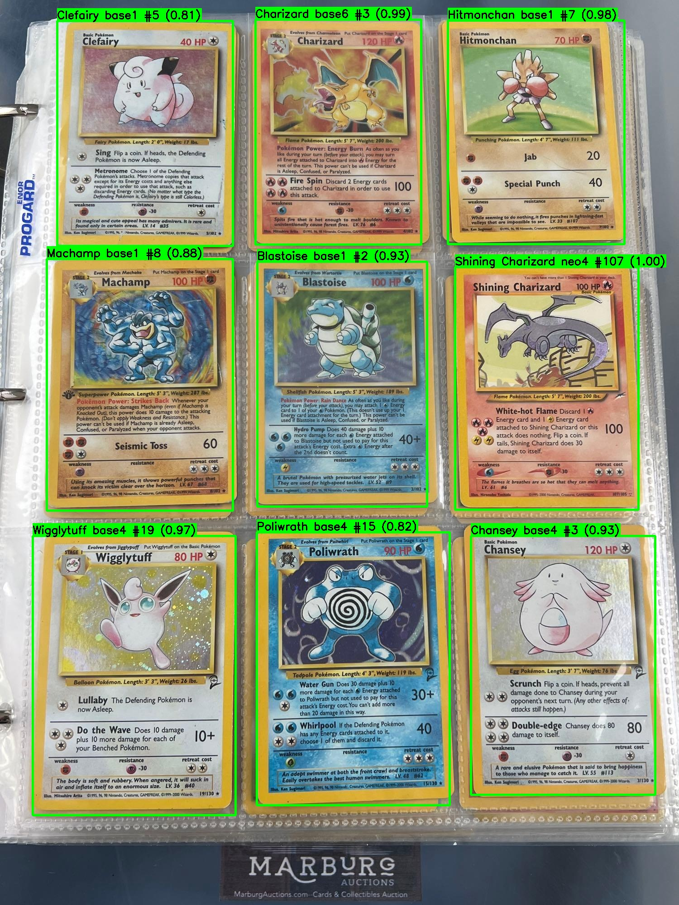
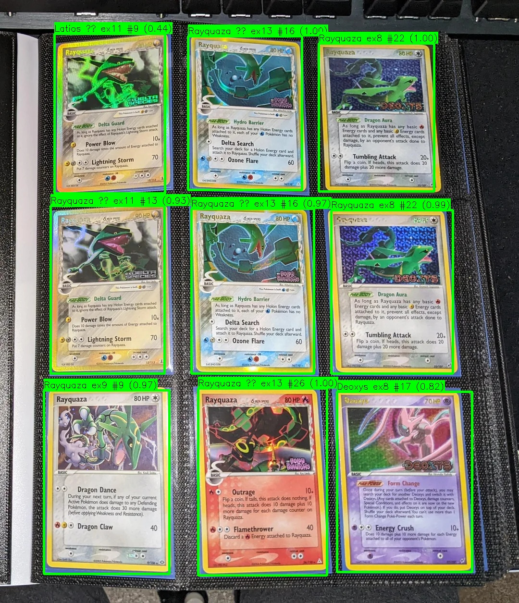

# Pokemon Cards Images Recognition

## Simple initial description:

Scraped Pokémon card images from eBay to build a dataset for training a computer vision model capable of identifying which specific card is shown in a single-image input (one card per image).

Additionally, developed a second model for multi-card detection, allowing the system to detect multiple Pokémon cards in a single image. Each detected card is then classified using the first model.

# Not finished yet
  🔨🚧🔨🚧🔨🚧🔨

  Cards detection and recognition results:

  
